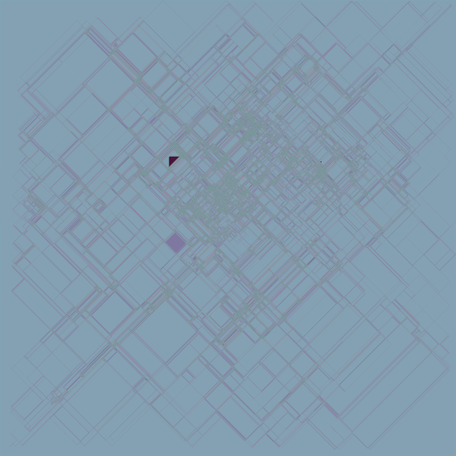

This repository contains a C++ and web implementation of the [Langton's ant](https://wikipedia.org/wiki/Langton's_ant) universal Turing machine.

The web version can be found [here](https://rafa-br34.github.io/LangtonsAnt)

## Table of contents
* [Implementation notes](#implementation-notes)
* [Usage](#usage)
  * [Web version](#web-version)
  * [C++ version](#c-version)
    * [Arguments](#arguments)
      * [`x` & `y`](#x---y)
      * [`m`](#m)
      * [`a`](#a)
      * [`i`](#i)
      * [`s`](#s)
      * [`o`](#o)
      * [`t`](#t)

# Implementation notes
Both the C++ ([Ant.h](https://github.com/rafa-br34/LangtonsAnt/blob/master/SOURCE/Types/Ant.h)) and JavaScript ([Ant.js](https://github.com/rafa-br34/LangtonsAnt/blob/master/WEBSITE/Scripts/Ant.js)) version share the same implementation concept.
There's support for 8 possible operations, which are:
- R45/L45
- R90/L90 (or R/L)
- R135/L135
- C (continue)
- U (180 degree turn)
# Usage
## Web version
Placeholder

## C++ version
### Arguments:
#### `-x` & `-y`:
Canvas width/height
#### `-m`: 
Defines a state machine, can later be used when defining a ant with `-a`.  Can be chained using `;`  
Example:  
`-m LRRRRRLLR;RLLLLLRRL`: Creates two state machines with index 0 and 1
#### `-a`:
Defines ants using the following format `P(X,Y)D(DX,DY)M(M)S(S)F(W?)` which can be chained using `;`
- `P` Initial position
- `D` Initial direction
- `M` Defines which state machine to use, this can be a string (for example `RL`/`R90L90`) or a index when using the `-m` argument
- `S` Defines the step size
- `F` Optional section that defines flags (W: Wrap)

Example:  
`-a P(500,500)D(0,-1)M(RL)`: Creates a single ant with the state machine `RL`  
`-a P(500,500)D(0,-1)M(0)S(10)F(W);P(500,500)D(0,1)M(1)`: Creates two ants using state machine 0 and 1, ant 0 wraps and has a step size of 10  
#### `-i`:
Defines how many iterations should be evaluated, by default it will run until all ants run out of bounds or (if wrap is enabled) will run indefinitely. Alternatively `t` can be added before the number to make it time based.  
Example:  
`-i i50b`: Run for 50 billion iterations  
`-i t100s`: Run a maximum of 100 seconds  
#### `-s`:
Defines when a canvas snapshot should be taken. Can be chained using `;`
- `i<interval?>`: Snapshots every `interval` iterations (if not specified 1 is assumed)
- `f`: Snapshots the final state
#### `-o`:
Defines how to output images.  
- `f:<format>:<name>`: Write image files. `%d` can be used for the image index and `%i` for the current iteration.
- `s:<format>:<stdout|stderr|stream>:<stream_name?>`: Write images to a pipe/stream.
Supported formats:  
- `idx`: Outputs the raw buffer.
- `rgb24`: Outputs the raw buffer as RGB24.
- `png`: Outputs the raw buffer as PNG.
#### `-t`:
Defines how many threads should be used, for now this argument only changes the amount of threads used when encoding images, *eventually* multithreading for the ants will also be added.